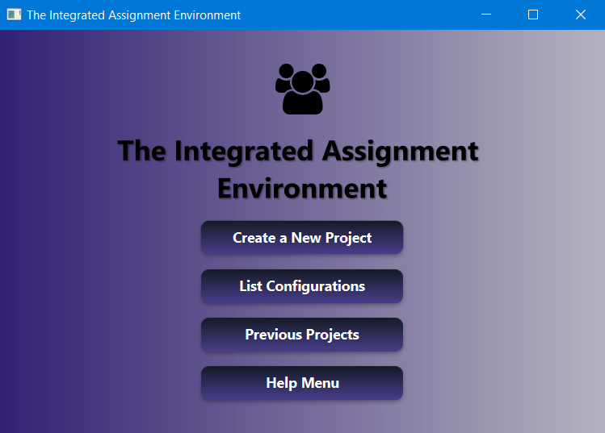
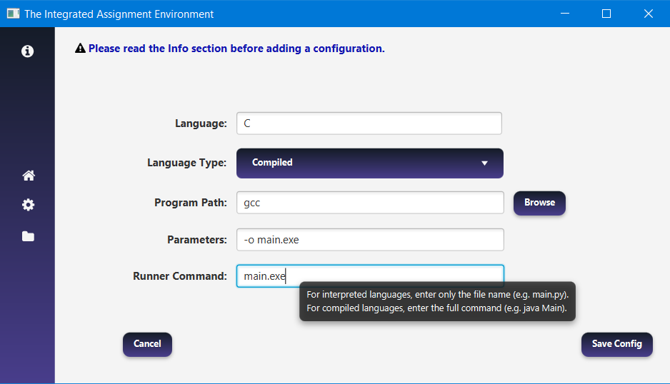
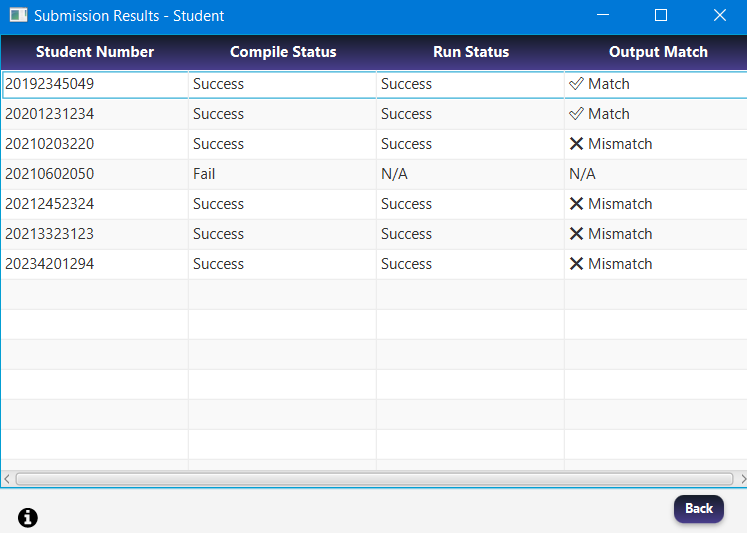

# The Integrated Assignment Environment (IAE-CE316)

**IAE** is a JavaFX-based application designed to automate the evaluation of student programming assignments. It simplifies the process of managing, compiling, running, and comparing student submissions against expected outputs. This project is developed as part of the **Programming Paradigm** course.
- You can find Project Description [in this folder](docs/ProjectDescription.pdf).
---

## Features
- **Project Management**:
    - Create new projects for programming assignments.
    - View and manage previously created projects.
- **Configuration Management**:
    - Add, edit, and delete configurations for different programming languages (e.g., Java, Python, C++).
    - Import and export configurations in JSON format.
- **Submission Evaluation**:
    - Automatically compile and run student submissions.
    - Compare student outputs with expected results.
    - Display detailed results for each submission.
- **Help System**:
    - Contextual help pages for various sections of the application.
    - Detailed user guides for creating projects, managing configurations, and viewing results.

---
### 🖼 Screenshots

You can find more screenshots [in this folder](docs/screenshots/).
Here are a few main views of the application:

#### Main Page



#### Configuration Creation Page  


#### Result Page



## ⚙️ How It Works

1. **Create a Configuration**
    - Define how a language is compiled and run:
        - Compiler/interpreter path (e.g., `gcc`, `python`, `C:\MinGW\bin\g++.exe`)
        - Compilation parameters (e.g., `-o main`)
        - Run command (e.g., `main.exe`, `main.py`,`java Main`)
        - Mark if the language is compiled or interpreted

2. **Create a Project**
    - Select a directory containing student `.zip` submissions
    - Provide an expected output file (`.txt`)
    - Add any command-line arguments

3. **Run & Compare**
    - Extracts each `.zip`
    - Validates the config matches source files (e.g., `.py` vs `.c`)
    - Compiles (if required)
    - Runs each submission and captures output
    - Compares it with the expected output

---

## 📦 Student Submission Format

- Each student submits a `.zip` file named after their **student number**
  Example: `2021123456.zip`

- The ZIP must contain the **source files directly** or inside a single folder

✔️ Both are accepted:
```
2021123456.zip
├── main.c
└── helper.c

OR

2021123456.zip
└── Elma/
    ├── main.c
    └── helper.c
```

- ⚠️ Do not submit `.rar`, `.7z`, or nested folders inside folders

---

## ⚠️ Common Warnings & Notes

- If a Java configuration is selected, the run command must **not include `.java`**:
  ```
  ✅ Run Command: java Main
  ❌ Run Command: java Main.java
  ```
- If an interpreted language (like Python) is selected, but compiled source files are present (like `.c`), the system will block the execution.
- If the program is installed and added to your system's environment variables, you can just write the command name (e.g., python, gcc).
  Otherwise, use the Browse button to provide the full path to the compiler or interpreter.

- The system supports commands structured as:  
  &lt;compiler path&gt; + &lt;parameters&gt; + &lt;source files&gt;

- This system supports a wide range of popular compiled and interpreted programming languages, including:  
  C, C++, Java, Python, Node.js, TypeScript, Rust, Go, Kotlin, Bash, PHP, Perl, Scala, Pascal, Julia

🛈 Run command:
- For interpreted languages, just enter the file name (e.g. main.py)
- For compiled languages, enter the full command (e.g. java Main)


---

## ✅ Example Configurations

| Language     | Path       | Compile Params | Run Command | Compiled |
|--------------|------------|----------------|-------------|----------|
| C            | `gcc`      | `-o main.exe`  | `main.exe`  | ✅ Yes   |
| Java         | `javac`    |                | `java Main` | ✅ Yes   |
| Python       | `python`   |                | `main.py`   | ❌ No    |
| Node.js      | `node`     |                | `index.js`  | ❌ No    |

---


## 💾 Configuration Storage – JSON Files

The application stores all configuration and project data in **JSON format** under the user's home directory. This ensures persistence between sessions and allows the system to reopen previously saved configurations and projects at any time.

### Default Paths

| Type            | Path                                 |
|-----------------|--------------------------------------|
| Configurations  | `{user.home}/.iae-app/configs.json`  |
| Projects        | `{user.home}/.iae-app/projects.json` |

These files are automatically created when the application is used.

---

## 🧪 Technical Details and Dependencies

### Java Environment

- **Java Version**: `23.0.2`
- **JavaFX**: `17.0.6`


### Build Tool

- **Apache Maven 3.9.9**
- Used for build automation and dependency management

### Dependencies (From `pom.xml`)

| Library              | Purpose                                               |
|----------------------|--------------------------------------------------------|
| JavaFX               | GUI development                                       |
| Gson                 | JSON serialization (`configs.json`, `projects.json`)  |
| FontAwesomeFX        | UI icons                                               |
| JUnit 5              | Unit testing                                           |
| Maven Shade Plugin   | Fat JAR creation                                       |
| JavaFX Maven Plugin  | JavaFX runtime & JLink support                         |

### Icons

- `FontAwesomeFX` is used to provide intuitive UI icons for buttons and menus

---

## 🚀 Getting Started

### Build & Run

```bash
mvn clean package
java -jar target/ce316-project-1.0-SNAPSHOT.jar
```

Or run directly via your IDE.

---

## 📄 License

This project is **not open-source** and is intended for educational demonstration only. 

